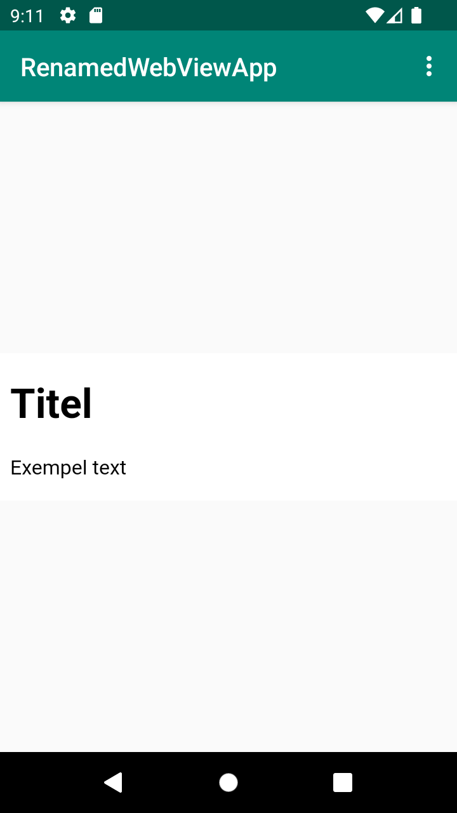
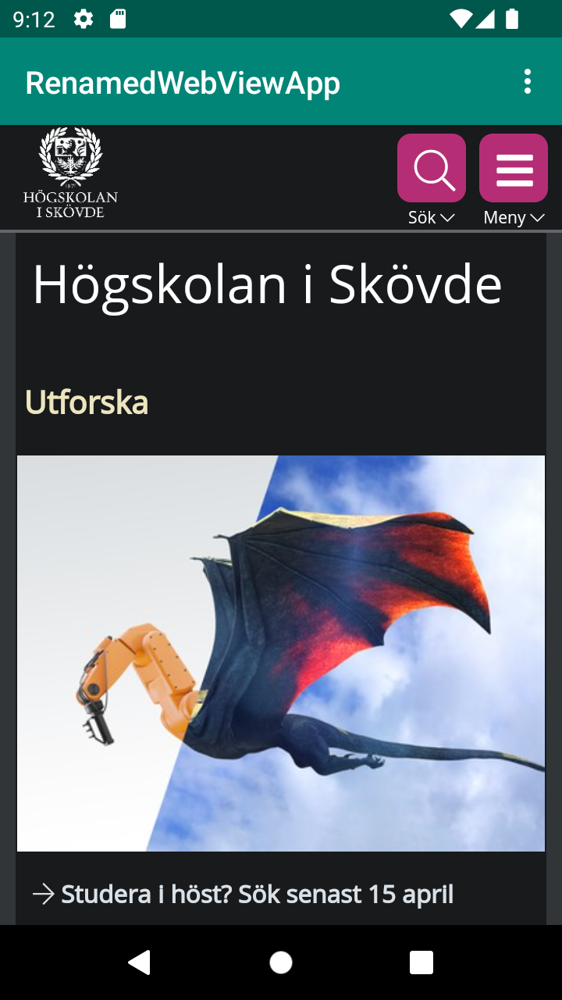

# Rapport

- Uppgiften var att skapa en webview där det går att få in en länkad webssida i mobilformat. Detta har skapats genom att skapa en privat WebView i "MainActivity.java" filen. Det har sedan skapats en loadUrl för den här för att kunna länka till hemsidor. Denna koden med länken lades in i funktionerna showinternalpage och showexternalpage. Dessa funktioner kallades sedan i menyfunktionen som kollar vilken av de som är selected.
``` 
import android.webkit.WebSettings;
import android.webkit.WebView;
import android.webkit.WebViewClient;

public void showExternalWebPage(){
    // TODO: Add your code for showing external web page here
    myWebView.loadUrl("https://his.se");
}

public void showInternalWebPage(){
    myWebView.loadUrl("file:///android_asset/html/WebView.html");
}

if (id == R.id.action_external_web) {
    showExternalWebPage();
    Log.d("==>","Will display external web page");
    return true;
}

if (id == R.id.action_internal_web) {
    showInternalWebPage();
    Log.d("==>","Will display internal web page");
    return true;
}
```

